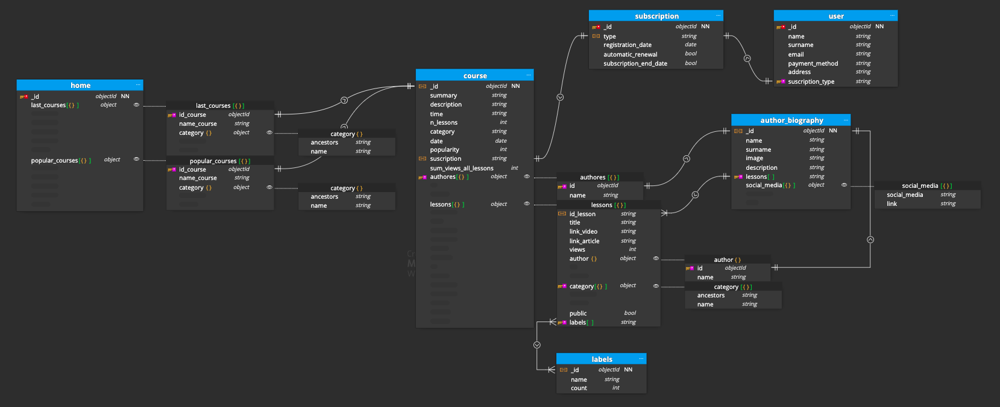
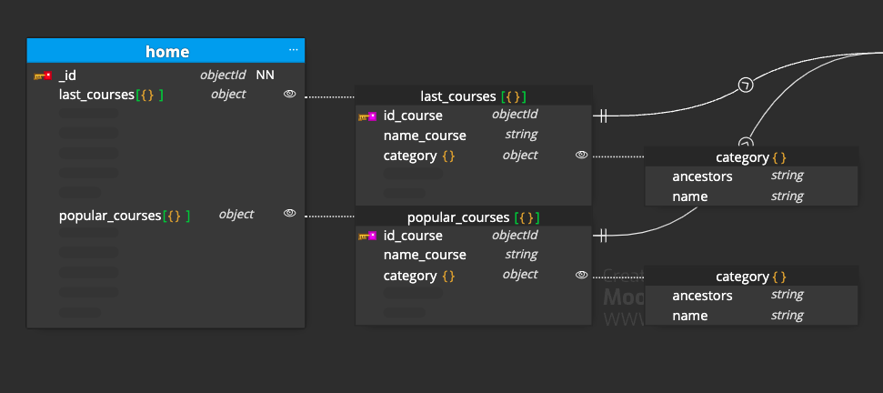
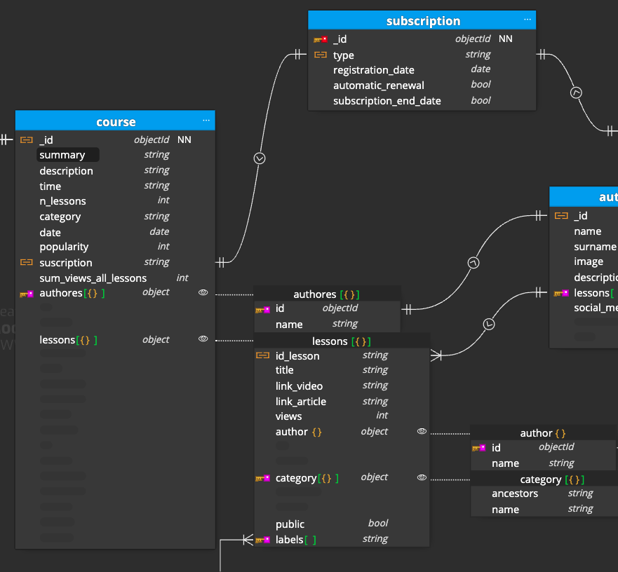
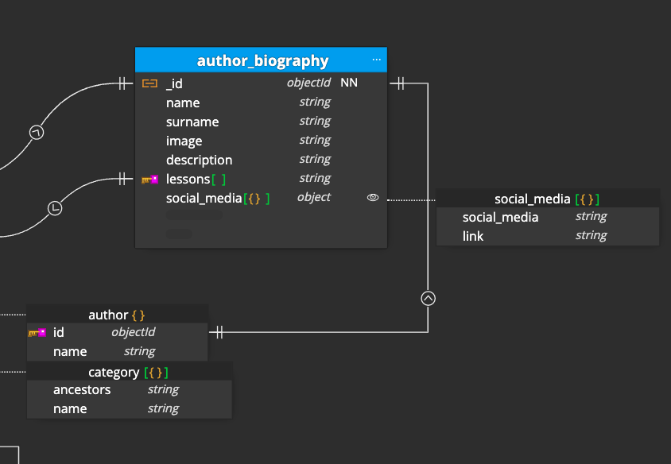
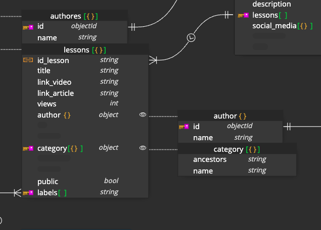
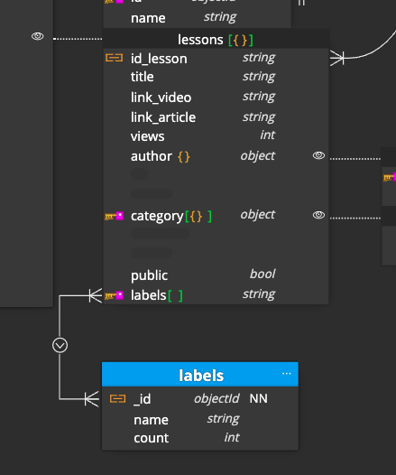

# 00-entrega-modelado

## Basic case

**eLearning** portal with courses of **programing**

### Overview

### 1. Home

**SUBSET PATTERN** - Unused data is extracted in the home page to optimize space and optimize space in the Working Set.

The home page has been embedded in a table with the aim of loading as quickly as possible, established in the Workset, it will not take up much space since we only have the last_courses and popular_courses objects with the most recently added courses, their names and their categories to be able to classify them on the home page. We will maintain a relationship with the **course** table through the course id.

Duplicate data should not change, since once a course is uploaded, it would be exceptional for the name to change.

Added **Materialized Paths** pattern to organize categories and subcategories

### 2. Courses

**EXTENDED REF pattern** - When we access the details of the course, we want to load the page quickly, as we have a maximum of 20 videos per course, we decide to embed the lessons within the course, the video and the description will be links so they will not take up much space.

This would also be in the Working Set.

The **subscription field** is added to the course to know if the entire course should be shown to the user or not.

The **COMPUTED pattern** is added to calculate the total number of views of all the lessons in a course, as it is a data that is not necessary to have in real time, it can be calculated every X time

### 3. Authores

They are decided to be embedded within the courses, since it is information that should not change, it can be duplicated without problem.

### 3. Biography

**SUBSET pattern** - An author's biography is something that is not going to be visited much, it can be displayed in another separate table without problem, and **not** have it in the Working Set

### 4. Categories

**TREE pattern, Materialized Paths** - This pattern is chosen because although the information has to be duplicated, it is something that will not be changed and is a direct result.

### 5. Labels

For the labels we create another table where all the labels that exist will be stored, with a counter to control duplicates, in turn, we have embedded those that correspond to each video so that the search is as light as possible.

## Relations

- A course can only appear once in last_courses.
- A course can only appear once in popular_courses.
- A course can only have one suscription.
- An user can only have one suscription.
- An author can only have one biography.
- A biography can have several lessons.
- Several lesson can have several labels.